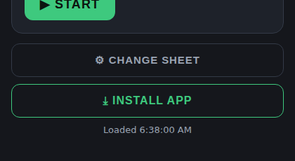

# Workout Player

A single-page workout timer/player that reads its program from a published
Google Sheet (or any hosted CSV). Open `index.html`, paste a published CSV
link, and it turns each row into a set/rest/exercise sequence with voice
cues and beeps.

You can also skip the paste step by passing the CSV link as a `csv` query
parameter, e.g. `index.html?csv=https://docs.google.com/.../pub?output=csv` —
the app loads it directly on boot and remembers it for next time, just like
pasting it into the setup screen.

CSV columns (row 1 headers, case-insensitive): `Workout, Exercise, Sets,
Reps, Weight, WorkTime, RestSet, RestAfter, Note`.

`testdata/workout-sample.csv` is a sample program covering the app's edge
cases (pyramid reps, max reps, timed exercises, zero rest between sets, no
rest after the final exercise, notes with commas/quotes) and is used as a
fixture by the end-to-end tests.

## Install it as an Android app

The app is a PWA, so Chrome on Android can install it to the home screen —
it then launches full screen, with its own icon and task-switcher entry, and
no browser UI.

1. Serve it over **HTTPS** (GitHub Pages works; `localhost` also counts).
2. Open it in Chrome on the phone, load your sheet once.
3. Tap **⤓ Install app** at the bottom of the home screen — or Chrome's
   menu → **Add to Home screen** if the button isn't showing.



The pieces that make it installable:

- `manifest.json` — name, `display: standalone`, theme colours, and the
  192/512 px icons (plain plus maskable, so Android can apply its own shape).
- `sw.js` — a service worker that precaches the app shell, so an installed
  copy opens offline and replays its last-loaded program from
  `localStorage`. The sheet CSV itself is never cached by the worker; when
  that fetch fails the app falls back to its stored copy.
- `icons/` — `icon.svg` / `icon-maskable.svg` are the sources; the PNGs are
  generated with `node tools/make-icons.mjs` and committed, so the project
  stays a no-build static site.

Updates ship as soon as they're deployed: the worker serves the page and
`workout-engine.js` network-first (with a 4s timeout before it falls back to
the cache), so an online launch always gets the current code while a dead or
crawling connection still opens instantly. Bump `CACHE_VERSION` in `sw.js`
when a shell file changes so stale caches are dropped.

On iOS, Safari's **Share → Add to Home screen** gives the same standalone
launch (`apple-touch-icon` and the `apple-mobile-web-app-*` tags cover it),
but Safari has no install button to offer.

## Development

```
python3 -m http.server 8080   # then open http://localhost:8080
```

## Tests

```
npm install
npx playwright install --with-deps chromium   # first time only
npm test            # unit tests + end-to-end tests
npm run test:unit    # workout-engine.js logic only (no browser)
npm run test:e2e     # Playwright, drives the app in a real browser
```

- `workout-engine.js` holds the pure CSV-parsing/workout-building logic so
  it can be unit tested with Node's built-in test runner, no browser needed.
- `tests/e2e` drives the actual UI (setup → home → player) against the
  sample CSV with Playwright.
- `tests/e2e/pwa.spec.js` covers the installable bits: the manifest, the
  service worker registering, and a reload with the network cut off still
  showing the last-loaded program.
